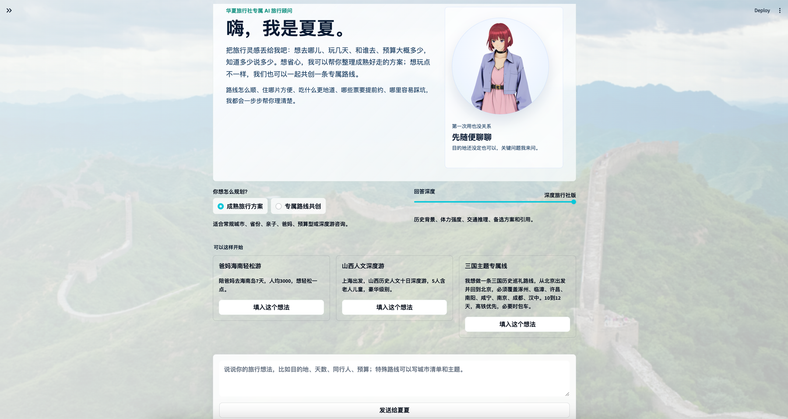
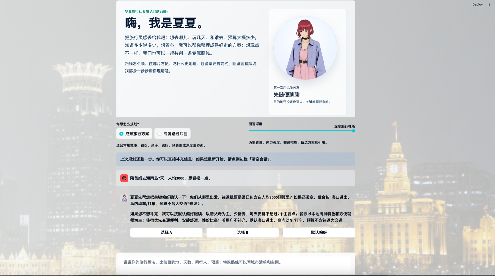
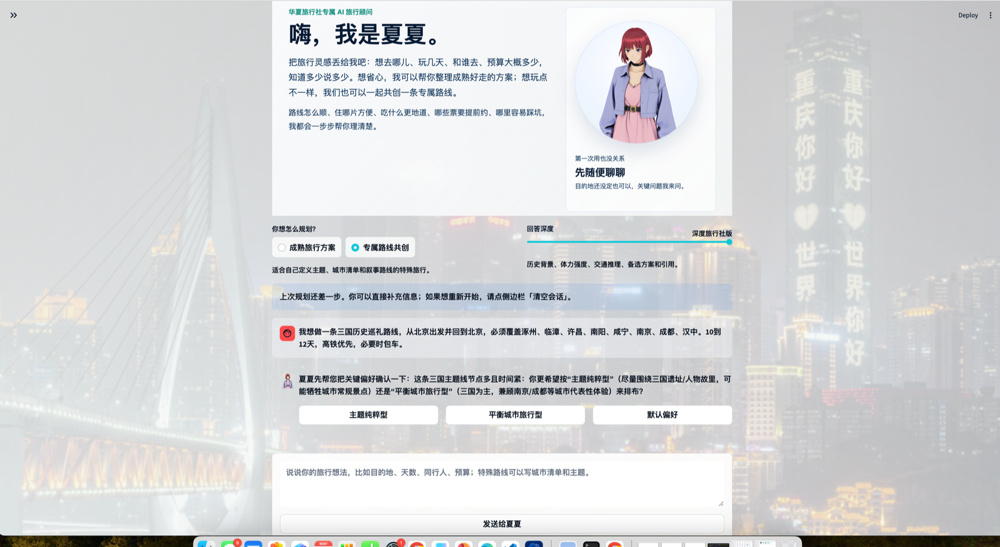
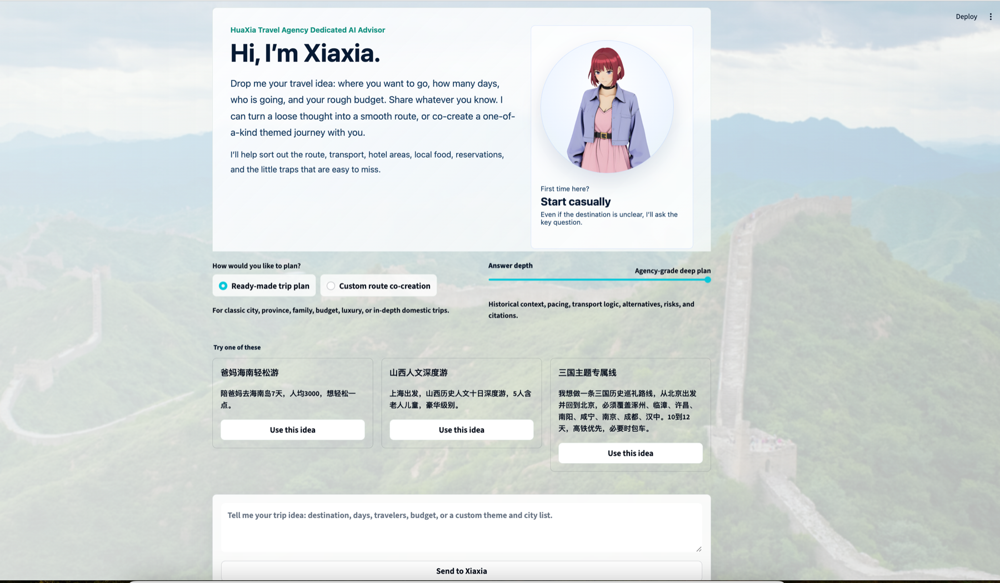

# HuaXia Tourism RAG

**Language:** English | [简体中文](README.zh-CN.md)

## Live Demo

**Try Xiaxia now:** <https://huaxiatourismrag-tx26tmcms8raaogz828jga.streamlit.app/>

Open the Streamlit app to test the current public-facing prototype for HuaXia
Travel Agency's AI travel consultant. The backend should be deployed separately
and configured through `STREAMLIT_API_BASE_URL` for production use.

## Product Preview

Xiaxia is designed as a polished AI front desk for HuaXia Travel Agency: users can
start with a casual travel idea, choose between mature trip planning and custom
route building, answer clarification checkpoints, and continue toward a
consultant-ready itinerary.

<p align="center">
  <a href="docs/assets/product/xiaxia-demo.mp4">
    
  </a>
</p>

<p align="center">
  <a href="docs/assets/product/xiaxia-demo.mp4"><strong>Watch the 60-second product walkthrough</strong></a>
</p>

<table>
  <tr>
    <td width="50%">
      <strong>Multi-hop clarification</strong><br>
      <sub>When user intent is incomplete, Xiaxia asks focused follow-up questions before generating a weak itinerary.</sub><br><br>
      
    </td>
    <td width="50%">
      <strong>Build a custom route</strong><br>
      <sub>DIY routes preserve user-defined cities and themes while still allowing route optimization.</sub><br><br>
      
    </td>
  </tr>
  <tr>
    <td width="50%">
      <strong>Bilingual product surface</strong><br>
      <sub>The same frontend supports Chinese-first service and an English-facing mode for future inbound use cases.</sub><br><br>
      
    </td>
    <td width="50%">
      <strong>Business-ready front desk</strong><br>
      <sub>The UI is built around travel consultation, answer depth control, custom routes, and future consultant handoff.</sub><br><br>
      
    </td>
  </tr>
</table>

HuaXia Tourism RAG is a proprietary agentic, web-augmented RAG platform designed for **HuaXia Travel Agency**. It turns open-ended Chinese domestic-travel requests into structured, citation-aware itinerary advice that can support online consultation, pre-sales planning, lead qualification, and future handoff to human travel consultants.

The product is built around Chinese tourists and China-specific travel operations: route logic, transport feasibility, hotel-area recommendations, local food, attraction tradeoffs, policy constraints, booking checks, risk reminders, and agency-style itinerary communication.

The assistant persona is **夏夏**, HuaXia Travel Agency's branded AI travel consultant. 夏夏 is intentionally warmer than a generic chatbot: friendly enough for younger users, but still professional enough for travel-agency service scenarios.

## Business Positioning

This project is not only a generic travel Q&A bot. It is intended to become HuaXia Travel Agency's owned AI consultation layer:

- **Pre-sales advisor:** Help users clarify where to go, how long to travel, who is traveling, budget level, transport preference, hotel style, food interests, and risk constraints.
- **Custom itinerary engine:** Generate conventional trips and unusual self-designed routes that standard travel products do not cover well.
- **Web-augmented research assistant:** Search and parse current web pages for attraction status, official rules, transport references, food/area hints, and hidden-gem inspiration.
- **Internal policy memory:** Retrieve tourism law, transport rules, consumer protection, insurance, medical, customs, safety, and regulatory documents from Qdrant.
- **Citation-aware planning:** Keep answer claims grounded in parsed web pages or indexed internal documents, reducing unsupported travel advice.
- **Agency workflow foundation:** Prepare for future official website redirects, email/CRM lead capture, consultant handoff, and booking workflow integration.

## What It Does

- Answers conventional Chinese tourism questions through `POST /tourism/questions`.
- Generates highly customized DIY routes through `POST /tourism/itineraries/diy`.
- Supports multi-hop clarification sessions when a request is too ambiguous to answer well.
- Provides a branded assistant tone through 夏夏, HuaXia Travel Agency's AI travel consultant persona.
- Searches the web with Tavily or Exa, then parses pages with Firecrawl or a trafilatura fallback.
- Retrieves the agency's internal indexed corpus from Qdrant, currently focused on official Chinese tourism, transport, legal, regulatory, safety, consumer-protection, medical, insurance, customs, and finance-related travel rules.
- Uses Redis to persist pending clarification sessions.
- Provides a Typer CLI for local testing, stateful continuation, corpus building, and Qdrant indexing.
- Uses strict Pydantic DTOs for request/response shape.
- Filters evidence relevance so citations are tied to parsed web or internal source material rather than unrelated filler.

## Project Layout

```text
.
├── data/
│   └── internal/
├── src/huaxia_tourismrag/
│   ├── agents/
│   │   ├── diy_itinerary_planner.py
│   │   ├── research_planner.py
│   │   ├── tourism_agent.py
│   │   └── travel_checkpoints.py
│   ├── api/routes.py
│   ├── bootstrap.py
│   ├── cli.py
│   ├── core/config.py
│   ├── indexing/
│   ├── rag/
│   ├── schemas/
│   ├── services/
│   ├── tools/
│   └── vector/
├── tests/
├── docker-compose.yml
├── pyproject.toml
└── .env.example
```

## Core Architecture

```text
User question
  ↓
FastAPI route or CLI
  ↓
Travel checkpoint service
  ├─ if essential details are missing: create Redis pending session
  └─ if enough context exists: continue
  ↓
Research planner agent
  ↓
Internal RAG retrieval from Qdrant
  +
Fresh web search from Tavily/Exa
  +
Webpage parsing with Firecrawl/trafilatura
  ↓
Evidence merge, relevance filtering, reranking
  ↓
Citation formatter
  ↓
Tourism answer agent
  ↓
TravelAnswer DTO
```

The architecture is intentionally agentic but controlled. A planner agent converts user intent into research tasks, retrieval tools collect evidence from internal and web sources, checkpoint logic asks for missing high-impact preferences, and the final answer agent writes within the strict `TravelAnswer` DTO.

There are two main answer flows:

- **Conventional question flow:** For normal travel requests, from short prompts to detailed requests such as family trips, province-level deep travel, budget planning, attraction selection, and route advice.
- **DIY itinerary flow:** For unusual user-defined routes or themes that are not commonly sold as standard travel-agency products, such as a self-designed 三国历史巡礼 route across many cities.

Both flows return the same `TravelAnswer` response format.

## Current Product Differentiators

- **Chinese domestic-tourism focus:** The default audience is Chinese domestic tourists, not foreign visitors unless the user explicitly says otherwise.
- **Custom route moat:** The DIY endpoint is designed for uncommon, user-defined thematic routes that mature travel websites may not offer as standard products.
- **Freshness-aware research:** Web search and page parsing are used for timely operational details, while stale or generic internal references should not override current official web evidence.
- **Source authority control:** Official government, scenic-area, railway, airline, museum, and transport-provider sources should outrank blogs or OTA pages for operational facts.
- **Business-ready session flow:** Redis-backed sessions support multi-hop clarification, so the system can ask only the most important missing question before generating a serious plan.
- **Controllable answer depth:** Users or clients can request `concise`, `standard`, or `deep` answers, and complex routes can trigger a detail-level checkpoint before expensive research begins.
- **Internal compliance base:** The 60-source policy corpus gives the agent a stronger baseline for transport, legal, safety, consumer-rights, and travel-risk guidance.
- **Terminal UX for testing:** The CLI uses Chinese section titles and a branded 夏夏 greeting to better match the eventual user-facing assistant experience.

## Requirements

- Python `3.11+`
- `uv`
- Qdrant
- Redis
- OpenAI-compatible model access through PydanticAI
- Tavily or Exa API key
- Firecrawl API key

Optional but useful:

- Docker or Docker Compose for Qdrant and Redis
- Hugging Face model cache for local embeddings/reranking

## Setup

Clone and install dependencies:

```bash
git clone https://github.com/TianyuHanAaron/HuaXia_TourismRAG.git
cd HuaXia_TourismRAG
uv sync
```

Create your local env file:

```bash
cp .env.example .env
```

Fill in `.env` with your real keys. Do not commit `.env`.

Recommended local model setting while developing:

```env
ENABLE_MODEL_RERANKER=false
```

This keeps responses faster and avoids local GPU/MPS memory issues during testing.

To avoid the PydanticAI `openai:` deprecation warning, prefer:

```env
TOURISM_AGENT_MODEL=openai-chat:gpt-5.5
```

Use the actual model name available in your account.

## Environment Variables

See `.env.example` for the complete list.

Important variables:

```env
APP_NAME="HuaXia Tourism RAG"

TOURISM_AGENT_MODEL=openai-chat:gpt-5.5
OPENAI_API_KEY=your_openai_api_key_here
OPENAI_ADMIN_KEY=

SEARCH_PROVIDER=tavily
TAVILY_API_KEY=your_tavily_api_key_here
EXA_API_KEY=your_exa_api_key_here

FIRECRAWL_API_KEY=your_firecrawl_api_key_here

QDRANT_URL=http://localhost:6333
QDRANT_API_KEY=
QDRANT_COLLECTION=tourism_internal_docs
QDRANT_UPSERT_BATCH_SIZE=32
QDRANT_TIMEOUT_SECONDS=120

REDIS_URL=redis://localhost:6379/0
SESSION_TTL_SECONDS=86400

EMBEDDING_PROVIDER=local
EMBEDDING_MODEL=Qwen/Qwen3-Embedding-0.6B
EMBEDDING_DIMENSIONS=1024
EMBEDDING_API_URL=
EMBEDDING_API_KEY=
EMBEDDING_BATCH_SIZE=4
RERANKER_MODEL=BAAI/bge-reranker-v2-m3
ENABLE_MODEL_RERANKER=false
MAX_MODEL_RERANK_CANDIDATES=6

MAX_SEARCH_RESULTS=8
MAX_PAGES_TO_READ=6
TOP_K_CONTEXTS=4
MIN_RERANKER_SCORE=0.05
```

## Start Local Services

With Docker:

```bash
docker compose up -d qdrant redis
```

To run the full local stack with the containerized FastAPI backend and
Streamlit frontend:

```bash
docker compose --profile app up --build
```

Then open:

- FastAPI health: `http://127.0.0.1:8000/tourism/health`
- Streamlit UI: `http://127.0.0.1:8501`

If Docker is unavailable on macOS, Redis can be started with Homebrew:

```bash
brew install redis
brew services start redis
redis-cli ping
```

For Qdrant without Docker, use Qdrant Cloud or another local Qdrant installation and set `QDRANT_URL` accordingly.

## Run the API

Load env vars and start FastAPI:

```bash
set -a
source .env
set +a

uv run uvicorn huaxia_tourismrag.main:app --reload --host 127.0.0.1 --port 8000
```

Health check:

```bash
curl http://127.0.0.1:8000/tourism/health
```

Capabilities:

```bash
curl http://127.0.0.1:8000/tourism/capabilities
```

## Streamlit Frontend

For a polished local kiosk-style interface, start the FastAPI server first, then run:

```bash
uv run streamlit run src/huaxia_tourismrag/streamlit_app.py
```

The Streamlit UI is designed as the current user-facing prototype for Xiaxia. It gives first-time users a simple mode choice between mature travel planning and custom route co-creation, supports `concise`, `standard`, and `deep` answer depth, handles pending clarification sessions, and renders answers with Chinese sections for highlights, warnings, itinerary, citations, and service checks. The shell randomly rotates China travel backgrounds from local assets on fresh sessions. The UI calls the existing FastAPI endpoints, so it can later be replaced by a React frontend without changing the backend API contract.

## Deployment

Deploy the product as two services:

1. **FastAPI/RAG backend** on a backend host such as Render, Railway, Fly.io, Google Cloud Run, or another Python service platform.
2. **Streamlit frontend** on Streamlit Community Cloud.

### Backend Deployment

The backend is container-ready through `Dockerfile`. Any host that can run a
Docker web service can use the image directly. The service listens on
`${PORT:-8000}` and exposes:

```text
/tourism/health
/tourism/questions
/tourism/itineraries/diy
/tourism/sessions/{session_id}/reply
```

If your backend host deploys from source instead of Docker, use a no-sync start
command so the host does not reinstall dependencies or compile bytecode at
runtime:

```bash
uv run --no-sync uvicorn huaxia_tourismrag.main:app --host 0.0.0.0 --port $PORT
```

Set backend secrets on the backend host, not in GitHub:

- `OPENAI_API_KEY`
- `TOURISM_AGENT_MODEL`
- `SEARCH_PROVIDER`
- `TAVILY_API_KEY` or `EXA_API_KEY`
- `FIRECRAWL_API_KEY`
- `QDRANT_URL`, `QDRANT_API_KEY`, `QDRANT_COLLECTION`
- `REDIS_URL`
- `EMBEDDING_PROVIDER`, `EMBEDDING_API_URL`, `EMBEDDING_API_KEY`, `EMBEDDING_DIMENSIONS`
- Optional MCP keys such as `FIRECRAWL_MCP_*` and `TAVILY_MCP_*`

For production latency and low-memory hosts such as 512 MiB Render instances,
prefer a remote embedding endpoint and keep local model reranking disabled
unless you provision enough CPU/GPU memory:

```env
EMBEDDING_PROVIDER=remote
ENABLE_MODEL_RERANKER=false
MAX_SEARCH_RESULTS=4
MAX_PAGES_TO_READ=2
TOP_K_CONTEXTS=3
```

Redis is required for stateful multi-hop clarification. Qdrant is required for
internal document retrieval; use Qdrant Cloud or a managed/self-hosted Qdrant
instance and point `QDRANT_URL` at it.

### Frontend Deployment

For Streamlit Community Cloud:

- Public app: <https://huaxiatourismrag-tx26tmcms8raaogz828jga.streamlit.app/>
- Repository: `TianyuHanAaron/HuaXia_TourismRAG`
- Branch: `main`
- Main file path: `src/huaxia_tourismrag/streamlit_app.py`
- Python version: `3.11`
- Dependency file: `requirements.txt`

Set the frontend secret:

```toml
STREAMLIT_API_BASE_URL = "https://your-fastapi-backend.example.com"
```

If this secret is not set, the UI falls back to `http://127.0.0.1:8000`, which is correct only for local development.

The frontend can also run as a container with `Dockerfile.streamlit`. In that
case set `STREAMLIT_API_BASE_URL` to the deployed FastAPI URL.

## API Usage

### Conventional Travel Question

Use this for normal travel questions, whether short or detailed.

```bash
curl -X POST http://127.0.0.1:8000/tourism/questions \
  -H "Content-Type: application/json" \
  -d '{
    "question": "我想陪爸妈去海南岛玩7天，预算三个人总共1万左右，希望不要太累，帮我安排路线、住宿区域、美食和需要提前确认的事项。"
  }'
```

Optional structured context can also be supplied:

```json
{
  "question": "第一次去北京三天两晚怎么玩？",
  "destination": "北京",
  "travelers": 2,
  "budget_level": "mid_range",
  "detail_level": "standard",
  "interests": ["故宫", "胡同", "本地美食"],
  "language": "zh-CN"
}
```

Supported `detail_level` values:

- `concise`: route order, one-line daily outline, key reminders, short citation list.
- `standard`: practical daily route, transport logic, hotel area, food direction, key warnings.
- `deep`: agency-grade plan with historical context, transport reasoning, pace, lodging strategy, alternatives, risks, and citations.

### DIY Itinerary Question

Use this only for user-designed routes or unusual themes where the route is not a standard travel-agency product.

```bash
curl -X POST http://127.0.0.1:8000/tourism/itineraries/diy \
  -H "Content-Type: application/json" \
  -d '{
    "question": "三国历史巡礼，从北京出发，路线必须包含涿州、安阳、许昌、南阳、咸宁、南京、成都、汉中，10到12天，可以按交通合理性调整顺序。"
  }'
```

### Multi-Hop Clarification Reply

If the service returns `needs_reply: true`, answer the clarification with:

```bash
curl -X POST http://127.0.0.1:8000/tourism/sessions/<SESSION_ID>/reply \
  -H "Content-Type: application/json" \
  -d '{
    "message": "平衡旅行型：三国主题必须覆盖，但每个城市也可以加入最值得去的文化景点和本地美食。交通优先高铁，必要时包车，10到12天都可以。"
  }'
```

## CLI Usage

The package exposes a CLI:

```bash
uv run huaxia-tourismrag --help
```

### Interactive Chat

```bash
uv run huaxia-tourismrag chat
```

The interactive CLI starts with the branded Xiaxia assistant tone:

```text
嗨，我是夏夏，华夏旅行社专属 AI 旅行顾问。
把你的旅行想法丢给我吧：想去哪儿、玩几天、和谁去、预算大概多少，知道多少说多少。
还没定也没关系，我会帮你把路线、交通、住宿、美食和避坑点一步步理顺。
```

The CLI prints Chinese section titles such as `回答`, `亮点`, `提醒`, and `引用来源`. It also caches the latest pending `session_id`, so if 夏夏 asks a follow-up question, you can reply naturally without copying the ID.

### Ask a Normal Travel Question

```bash
uv run huaxia-tourismrag ask "我想陪爸妈去海南岛玩7天，预算三个人总共1万左右，希望不要太累。"
```

Print raw JSON:

```bash
uv run huaxia-tourismrag ask "第一次去北京三天两晚怎么玩？" --raw --timeout 600
```

Control answer depth:

```bash
uv run huaxia-tourismrag ask "北京三天怎么玩？" --detail concise
uv run huaxia-tourismrag diy "三国历史巡礼，从北京出发，经涿州、许昌、成都、汉中。" --detail deep
```

### Ask a DIY Route Question

```bash
uv run huaxia-tourismrag diy "三国历史巡礼，从北京出发，经涿州、安阳、许昌、南阳、咸宁、南京、成都、汉中，10到12天。"
```

### Reply to a Pending Session

If there is a cached pending session:

```bash
uv run huaxia-tourismrag reply "我更想平衡旅行型，三国主题必须覆盖，也要加入本地美食。"
```

Or pass the session ID explicitly:

```bash
uv run huaxia-tourismrag reply <SESSION_ID> "我更想平衡旅行型，交通优先高铁，必要时包车。"
```

### Health Check

```bash
uv run huaxia-tourismrag health
```

## Internal Documents and Qdrant

The old demo seed file has been removed. The internal knowledge base is now split into three business-oriented layers:

- `policy_transport_rules`: official policy, transport, safety, consumer-protection, medical, insurance, customs, finance, legal, and regulatory material that can affect real travelers.
- `structured_destinations`: structured scenic-area, heritage-site, destination, and theme-attraction rows used to ground itinerary claims.
- `food_specialties`: structured local cuisine and specialty rows used to make plans feel more like real agency advice.

Policy corpus path:

```text
data/internal/corpora/china_tourism_policy_transport_rules_60.jsonl
```

The curated 60-source manifest lives at:

```text
data/internal/manifests/china_tourism_policy_sources.json
```

Structured manifests live at:

```text
data/internal/manifests/china_scenic_area_sources.json
data/internal/manifests/china_heritage_sources.json
data/internal/manifests/china_food_specialty_sources.json
```

Structured row files live outside `manifests/` so source manifests stay clean and scalable:

```text
data/internal/rows/seed/scenic_theme_seed_rows.json
data/internal/rows/seed/heritage_seed_rows.json
data/internal/rows/seed/food_specialty_seed_rows.json
```

A production acquisition registry tracks broader official source candidates for nationwide expansion:

```text
data/internal/registries/china_structured_production_source_registry.json
```

It currently covers source candidates for 5A scenic areas, provincial 4A/3A scenic rows, national protected heritage sites, MCT intangible-food routes, and agricultural GI/specialty products.

Generated structured corpora:

```text
data/internal/corpora/china_scenic_5a4a3a.jsonl
data/internal/corpora/china_national_heritage_sites.jsonl
data/internal/corpora/china_food_specialties_brands.jsonl
```

The project includes an `InternalCorpusIndexer` for loading JSONL, chunking documents, embedding text, and upserting chunks into Qdrant. Local indexing is batched through `EMBEDDING_BATCH_SIZE` and `QDRANT_UPSERT_BATCH_SIZE` to reduce MPS/GPU memory pressure and Qdrant Cloud write timeouts.

The expected JSONL rows map to the internal raw document DTO used by the indexer. Rows may use either `document_id` or `id`, and can include `content_type`, `published_at`, `retrieved_at`, `location`, `province`, `city`, `district`, `level`, `tags`, `official_status`, and `authority`.

Example:

```json
{"id":"policy:railway-passenger-rules","title":"铁路旅客运输规程","source_name":"中国铁路12306","url":"https://mobile.12306.cn/otsmobile/h5/otsbussiness/info/transportationRules.html","content_type":"railway","text":"..."}
```

Build the JSONL corpus from the manifest:

```bash
uv run huaxia-tourismrag build-internal-corpus \
  data/internal/manifests/china_tourism_policy_sources.json \
  --output data/internal/corpora/china_tourism_policy_transport_rules_60.jsonl
```

Build structured destination, heritage, and food corpora:

```bash
uv run huaxia-tourismrag build-structured-corpus \
  data/internal/manifests/china_scenic_area_sources.json \
  --output data/internal/corpora/china_scenic_5a4a3a.jsonl

uv run huaxia-tourismrag build-structured-corpus \
  data/internal/manifests/china_heritage_sources.json \
  --output data/internal/corpora/china_national_heritage_sites.jsonl

uv run huaxia-tourismrag build-structured-corpus \
  data/internal/manifests/china_food_specialty_sources.json \
  --output data/internal/corpora/china_food_specialties_brands.jsonl
```

Inspect any JSONL corpus before indexing:

```bash
uv run huaxia-tourismrag inspect-internal-corpus data/internal/corpora/china_scenic_5a4a3a.jsonl
```

This validates every row against `RawInternalDocument` and reports content-type, province, and authority coverage.

Inspect a structured source manifest and confirm its row files are present:

```bash
uv run huaxia-tourismrag inspect-structured-manifest data/internal/manifests/china_scenic_area_sources.json
```

Inspect the production acquisition registry:

```bash
uv run huaxia-tourismrag inspect-source-registry \
  data/internal/registries/china_structured_production_source_registry.json
```

Scaffold empty target row files declared by the registry:

```bash
uv run huaxia-tourismrag scaffold-structured-row-files \
  data/internal/registries/china_structured_production_source_registry.json
```

Use the scaffold command only to create empty targets for acquisition work. Do not index scaffolded empty/template files until real rows have been filled and checked.
JSON targets are created as empty arrays (`[]`), and CSV targets are created with headers only.

Import cleaned CSV/JSON rows into the registry-defined target row file:

```bash
uv run huaxia-tourismrag import-structured-rows \
  data/internal/registries/china_structured_production_source_registry.json \
  china_5a_scenic_areas \
  path/to/cleaned_5a_rows.csv
```

Then rebuild all standard structured corpora in one step:

```bash
uv run huaxia-tourismrag build-all-structured-corpora
```

Index the corpus:

```bash
uv run huaxia-tourismrag index-internal data/internal/corpora/china_tourism_policy_transport_rules_60.jsonl
```

Index all corpus layers in the standard order: policy/rules first, then scenic areas, national heritage, and food/specialty documents. The batch command applies `--recreate` only to the first corpus, so the later layers append into the same rebuilt collection:

```bash
EMBEDDING_BATCH_SIZE=1 QDRANT_UPSERT_BATCH_SIZE=8 \
uv run huaxia-tourismrag index-all-internal --recreate
```

Equivalent manual sequence:

```bash
EMBEDDING_BATCH_SIZE=1 QDRANT_UPSERT_BATCH_SIZE=8 \
uv run huaxia-tourismrag index-internal data/internal/corpora/china_tourism_policy_transport_rules_60.jsonl \
  --recreate

EMBEDDING_BATCH_SIZE=1 QDRANT_UPSERT_BATCH_SIZE=8 \
uv run huaxia-tourismrag index-internal data/internal/corpora/china_scenic_5a4a3a.jsonl

EMBEDDING_BATCH_SIZE=1 QDRANT_UPSERT_BATCH_SIZE=8 \
uv run huaxia-tourismrag index-internal data/internal/corpora/china_national_heritage_sites.jsonl

EMBEDDING_BATCH_SIZE=1 QDRANT_UPSERT_BATCH_SIZE=8 \
uv run huaxia-tourismrag index-internal data/internal/corpora/china_food_specialties_brands.jsonl
```

Use a custom Qdrant collection:

```bash
uv run huaxia-tourismrag index-internal data/internal/corpora/china_tourism_policy_transport_rules_60.jsonl \
  --collection tourism_policy_rules
```

Delete the existing collection first, then rebuild it:

```bash
uv run huaxia-tourismrag index-internal data/internal/corpora/china_tourism_policy_transport_rules_60.jsonl \
  --recreate
```

For production, prefer official sources such as national tourism law, agency compliance, railway and aviation rules, customs, consumer protection, medical reimbursement, safety notices, and insurance guidance. Once HuaXia Travel Agency has proprietary business data, this corpus can be extended with negotiated supplier notes, hotel inspection notes, guide feedback, route SOPs, group-tour risk playbooks, and CRM conversion insights.

Before querying internal docs, the Qdrant collection must exist and be indexed. If Qdrant returns an error such as:

```text
Collection `tourism_internal_docs` doesn't exist
```

then the internal documents have not been indexed yet.

The Qdrant store creates keyword payload indexes for `tenant_id`, `source_type`, `content_type`, `source_name`, `province`, `city`, `level`, `official_status`, and `authority` when `ensure_collection()` runs.

Recommended first target size:

- MVP: 10,000-12,000 Qdrant rows across policy, scenic, heritage, and food corpora.
- Stronger domestic coverage: 15,000-25,000 rows.

The current structured manifests are intentionally small seed files that validate the pipeline. Production expansion should batch-import official 5A/4A scenic lists, selected 3A rows, national protected heritage sites, local-cuisine sources, and specialty catalogs.

To expand beyond seed data, add new row files under `data/internal/rows/` and reference them from the relevant source manifest through `row_file`. Both JSON and CSV row files are supported. CSV `tags` can be separated by `;`, `；`, `,`, `，`, `、`, or `|`.

The production target row files are already wired into the source manifests. Once real rows are added to these files, rerun `build-structured-corpus`; no manifest change is required:

```text
data/internal/rows/production/china_5a_scenic_rows.json
data/internal/rows/production/china_4a_3a_selected_scenic_rows.json
data/internal/rows/production/china_national_heritage_rows.json
data/internal/rows/production/china_local_cuisine_rows.json
data/internal/rows/production/china_agricultural_gi_specialty_rows.json
```

## Citations

The system is intended to cite only evidence that came from parsed web pages or internal curated documents.

Good citation behavior:

- Cite Tavily/Exa result pages only when their content was parsed and used.
- Prefer official scenic-area, museum, railway, airport, hotel, and government sources for operational facts.
- Use blogs and OTAs mainly for travel experience, route inspiration, hotel area hints, food discovery, and hidden-gem context.
- Avoid using unrelated generic citations to support a specific itinerary claim.

## Development

Run lint:

```bash
uv run ruff check src/huaxia_tourismrag tests
```

Run tests:

```bash
uv run pytest -q
```

Current test suite covers:

- API routes
- CLI behavior
- research planner
- DIY itinerary planner
- multi-hop checkpoint logic
- Redis session store
- session reply service
- Qdrant store mapping
- web search providers
- webpage reader
- citation formatter
- evidence merge and relevance filtering
- reranker fallback behavior

## Troubleshooting

### Redis Connection Refused

Error:

```text
redis.exceptions.ConnectionError: Error 61 connecting to localhost:6379
```

Start Redis:

```bash
brew services start redis
redis-cli ping
```

or:

```bash
docker compose up -d redis
```

### Qdrant Collection Missing

Error:

```text
Collection `tourism_internal_docs` doesn't exist
```

Start Qdrant and index internal documents before using internal RAG.

```bash
docker compose up -d qdrant
```

### Reranker Too Slow or Out of Memory

For local testing:

```env
ENABLE_MODEL_RERANKER=false
```

If enabling the model reranker, keep:

```env
MAX_MODEL_RERANK_CANDIDATES=6
```

and lower it further if your local machine runs out of memory.

### Request Timeout

Use a larger CLI timeout:

```bash
uv run huaxia-tourismrag ask "..." --timeout 600
```

Also consider lowering:

```env
MAX_SEARCH_RESULTS=5
MAX_PAGES_TO_READ=3
TOP_K_CONTEXTS=4
```

## Security Notes

- `.env` is ignored and must not be committed.
- Use `.env.example` for safe configuration examples.
- The placeholder auth in `api/routes.py` is for local development only. Replace it with JWT/session validation before production.
- Treat user travel requests as leads only after explicit user consent.
- For production booking workflows, connect the API to your official booking form, CRM, or email pipeline rather than letting the model directly complete payment-sensitive actions.

## Production Roadmap

Recommended next steps:

- Add authenticated users and real tenant identity.
- Add lead capture endpoint for users who want a human travel consultant.
- Add official website redirect or email/CRM handoff for booking requests.
- Add source authority scoring for official scenic-area pages and transport operators.
- Add cache for parsed web pages and official status checks.
- Add observability for search cost, parse failure rate, latency, and citation quality.
- Add a frontend chat interface with stateful session continuation.
- Add business analytics for high-intent routes, repeated destinations, unresolved questions, and consultant handoff outcomes.
- Add agency inventory and product matching once package tours, hotels, guides, transport vendors, or negotiated rates are available.
- Consider a company MCP server only when other AI clients or internal tools need standardized access to agency inventory, CRM, lead creation, booking status, or itinerary templates.
